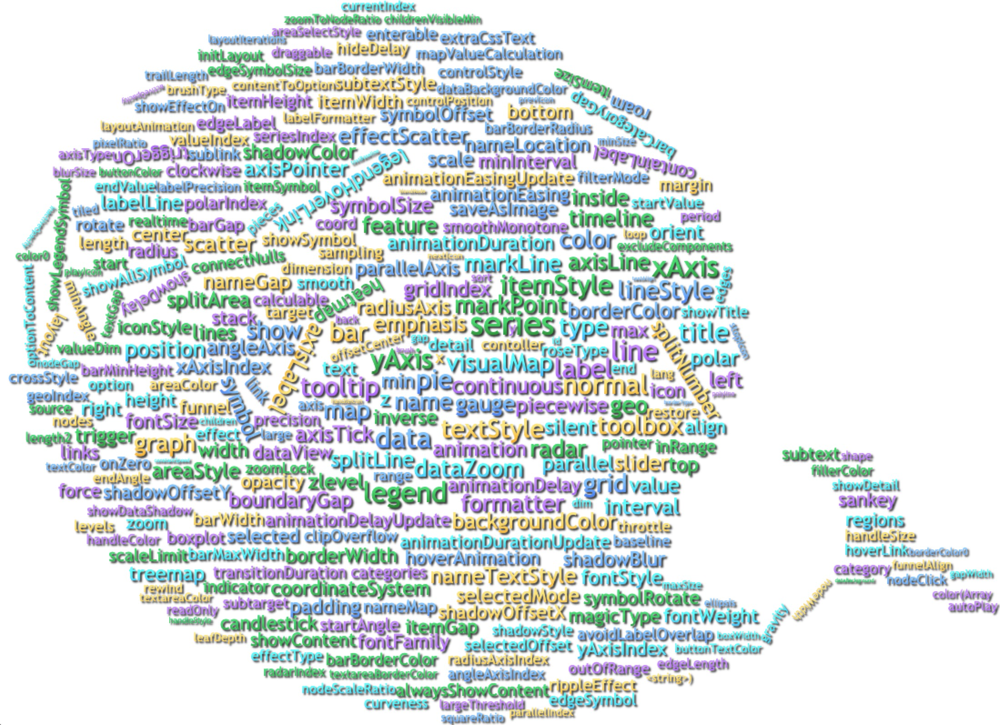

# b2wordcloud

[](https://nodei.co/npm/b2wordcloud/)

基于[wordcloud2.js](https://github.com/timdream/wordcloud2.js)生成2D词云图

扩展特性若干，如tooltip，渐变色，阴影



简单线上演示 [DEMO](https://holanlan.github.io/b2wordcloud/)

渐变+阴影+形状+点击高亮演示 [DEMO](https://holanlan.github.io/b2wordcloud/shape.html)

## Installtion
- 通过script引入
```
<script src="dist/b2wordcloud.min.js"></script>
```
- 通过npm安装
```
npm install b2wordcloud --save
```

## Usage
```javascript
var wordCloud = new B2wordcloud(document.getElementById("chart"), {
    list: [
        ['foo', 36], ['bar', 62], ['foo3', 22], ['bar4', 36], ['bar5', 46],['foo', 36], ['bar', 62], ['foo3', 22], ['bar4', 36], ['bar5', 46],['foo', 36], ['bar', 62], ['foo3', 22], ['bar4', 36], ['bar5', 46],['foo', 36], ['bar', 62], ['foo3', 22], ['bar4', 36], ['bar5', 46],['foo', 36], ['bar', 62], ['foo3', 22], ['bar4', 36], ['bar5', 46],['foo', 36], ['bar', 62], ['foo3', 22], ['bar4', 36], ['bar5', 46],['foo', 36], ['bar', 62], ['foo3', 22], ['bar4', 36], ['bar5', 46],['foo', 36], ['bar', 62], ['foo3', 22], ['bar4', 36], ['bar5', 46],['foo', 36], ['bar', 62], ['foo3', 22], ['bar4', 36], ['bar5', 46],['foo', 36], ['bar', 62], ['foo3', 22], ['bar4', 36], ['bar5', 46]
    ],
    tooltip: {
        show: true,
        formatter: function(item) {
            return '<div>' + item[0] + '</div>' + '<div>' + item[1] + '</div>'
        }
    },
    shadowColor: 'rgba(0,0,0,0.9)',
    shadowOffsetX: 2,
    shadowOffsetY: 2,
    shadowBlur: 5,
    color: [
        ['#f00', '#ff0'],
        '#f00',
        'green',
        '#333',
        'blue',
        ['blue', 'white']
    ]
})
```

## API documentation

基于[wordcloud2](https://github.com/timdream/wordcloud2.js)进行开发，因此基础API在此不重复描述，如有查看需要，可查看[wordcloud2 API documentation](https://github.com/timdream/wordcloud2.js/blob/gh-pages/API.md)

-以下为新增或有改动的配置项

### options
- `list`：基于原有配置项做了扩展，原有格式为[key,value],新增是否高亮选项，如['foo', 12332, true]，数组第三项则表示默认是否高亮
- `renderer`：新增配置项**渲染模式**，默认为"canvas"，可选择"div"
  - e.g. renderer: 'canvas'
- `tooltip`：新增配置项，格式为object格式，详细配置见下
  - `show`：是否显示tooltip，默认为true
  - `formatter`：自定义tooltip格式，返回html，回调参数为当前所选的词
  - `className`： 自定义tooltip的样式名
  - `background`：自定义tooltip背景色，默认为'rgba(0,0,0,0.8)'
- `color`：基于原有的color配置项做了修改，原color配置项支持字符串与函数，此处不变，可兼容原wordcloud2配置，新增特性为支持数组，当color为数组时，将按数组顺序取色，其中数组分以下两种情况
  - 当数组元素为颜色字符串时，直接使用渲染
  - 当数组元素为数组时，将使用数组元素渲染渐变色，v1.0.7版本更新，支持横向渐变或纵向渐变
    - e.g: color: [['blue', 'white', 0]]，如例子所示，将渲染从上到下由蓝到白的纵向渐变色
    - e.g: color: [['blue', 'white', 1]]，如例子所示，将渲染从左到右由蓝到白的横向渐变色
    - color格式为：[[color1, color2, color3, ...colorN, type]]，type为0或1，默认为0
- `shadowOffsetX`：新增配置项，文字阴影X轴偏移量
- `shadowOffsetY`：新增配置项，文字阴影Y轴偏移量
- `shadowBlur`：新增配置项，文字阴影模糊量
- `shadowColor`：新增配置项，文字阴影颜色
- `maskImage`： 新增配置项，白底黑形状图片，上传后词云可渲染图片形状
- `maxFontSize`：新增配置项，最大字号
- `minFontSize`：新增配置项，最小字号
- `cursorWhenHover`：新增配置项，鼠标经过时样式 'default' | 'pointer'

### methods

- resize()

当容器大小变化时，可调用此方法重新绘制

e.g: 
```javascript
var wordCloud = new B2wordCloud(element, options)

wordcloud.resize()
```

- dispatchAction

发送事件，目前支持highlight和downplay

e.g:
```javascript
var wordCloud = new B2wordCloud(element, options)

wordcloud.dispatchAction({
  type: 'highlight', // highlight或downplay
  dataIndex: 0, // 高亮数据索引
  keepAlive: true, // 高亮词是否唯一，false即同时只能高亮一个词
})
```


## 重要版本更新

### v2.0.0
- 字符大小逻辑重构
- 图片形状逻辑重构
- 支持词高亮
- 新增方法 `dispatchAction`方法，详细用法见文档

### v1.0.14
- 新增 `cursorWhenHover` 配置项

### v1.0.11
- 图片形状API实现错误，正确为 `maskImage`（遵循文档）

### v1.0.8

- 修复了tooltip移位问题

### v1.0.7

- renderer: 'div' 模式下，阴影改用filter: drop-shadow，阴影效果更佳
- renderer: 'canvas' 模式下优化渐变色计算逻辑，效果更佳
- 支持横向渐变与纵向渐变两种选项，详情见`color`配置项